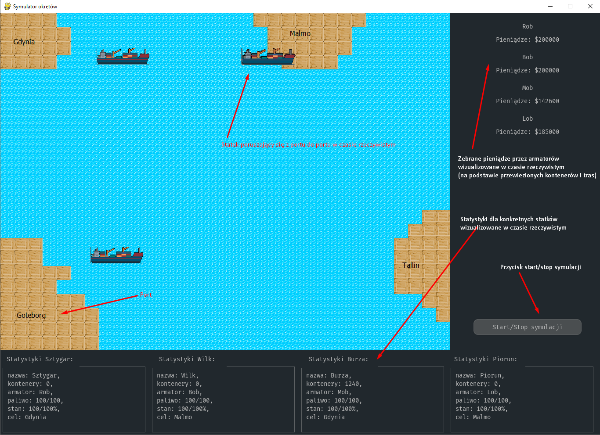
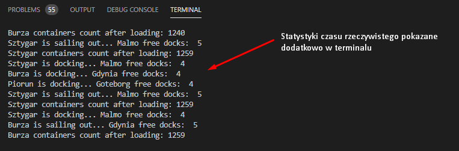
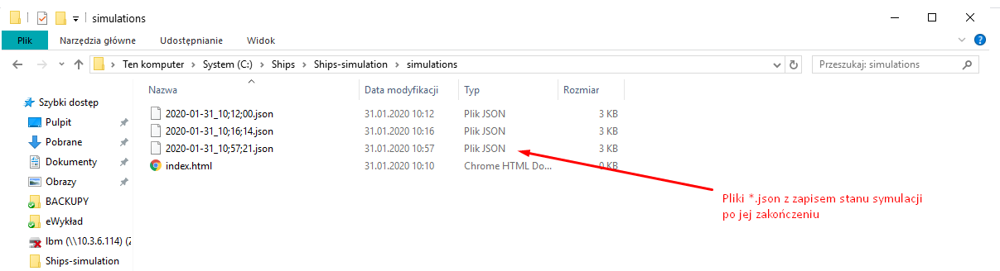

**Damian Dobrowolski, Adam Balcerzak (Informatyka AHE, semestr III)**
# Symulacja Okrętów - dokumentacja
### Programowanie obiektowe I, eProjekt

#### Lista użytych bibliotek:
- PyGame (biblioteka z podstawowymi instrukcjami do gier w Pythonie)
- PyGame GUI (biblioteka graficzna do GUI rozszerzająca działanie PyGame)
- pep8 (formatowanie kodu)
- csv (obsługa plików csv)
- json (obsługa plików json)

#### Lista użytego oprogramowania:
- Visual Studio Code (idle)
- Python 3.8.2 (środowisko programistyczne)
- Tiled Map Editor (wgranie tekstur i generowanie obszaru do mapy)

#### Struktura aplikacji:
- Główny plik wykonawczy: symulacja.py
- Logika i obiekty znajdują się w plikach *.py w katalogu models
- Komponenty odpowiedzialne za: GUI, ładowanie portów z pliku CSV, zapis symulacji do pliku oraz pływanie statków z punktu A do B znajdują się w katalogu helpers
- Pliki graficzne odpowiedzialne za mapy i GUI znajdują się w katalogu graphics
- Współrzędne portów znajdują się w pliku ports.csv w folderze const

#### Operacje na plikach *.csv i *.json:
- Wczytywanie współrzędnych portów z pliku const/ports.csv
- Po kliknięciu w przycisk Start/Stop symulacji - zapis danych symulacji do pliku *.json, pliku tworzone są w katalogu simulations w formacie data_godzina.json

#### Działanie programu z opisem:

#### Statystyki generowane w konsoli Pythona:

#### Pliki z zapisem symulacji:

#### Film z działaniem symulacji:

